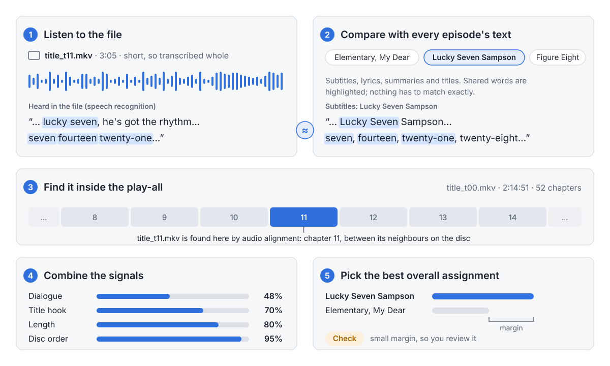

  <picture>
    <source media="(prefers-color-scheme: dark)" srcset="docs/images/header-dark.svg">
    
  </picture>

# Media Identifier

Media Identifier is a desktop app for macOS (Apple Silicon) and Windows that names ripped TV
episode files. Point it at a folder of unlabeled files, such as the titles MakeMKV rips from a
disc, and it listens to each file on your computer, compares what it heard with each episode's
subtitles, lyrics and length, uses the disc's "play all" title to check the order, and suggests
a show, season, episode and title for every file with the evidence behind it. After you review
the suggestions it renames the files in place for Jellyfin, Plex or Kodi, and History can undo
the renames. Audio and video never leave your computer.

**Download:** see [Releases](https://github.com/thomas-lane/media-identifier/releases) and the
[install guide](docs/install.md) (the builds are unsigned, so the first launch needs one extra
step).

## Status

| Component | State |
|---|---|
| Workspace, shared types, generated TypeScript types | Built and tested |
| Settings and API key storage | Built and tested |
| Command/event wiring between UI and app | Built; tested for name agreement only |
| UI shell and mock backend | Built and tested in jsdom |
| whisper.cpp build (Metal) | Builds and links on macOS arm64; transcription untested |
| Updater (check, download, relaunch) | Built; untested (no published release) |
| Folder scan, probing, audio decoding | Interface only |
| Model download and verification | Interface only (checksums pinned) |
| Episode lists, subtitles, lyrics, cache | Interface only |
| Matching and confidence | Interface only |
| Rename, copy, CSV export, undo | Interface only |
| Release workflow, Windows build | Not started |

## Documentation

- [Architecture](docs/architecture.md): crates, data flow, file ownership
- [How identification works](docs/identification.md)
- [Online sources](docs/sources.md): services, keys, limits, attribution
- [Install](docs/install.md)
- [Development](docs/development.md): build, test, release
- [Glossary](docs/glossary.md)
- [Developer guide for agents](AGENTS.md)

Episode data comes from [TVmaze](https://www.tvmaze.com) (CC BY-SA 4.0). Licensed MIT; see
[LICENSE](LICENSE) and [THIRD_PARTY.md](THIRD_PARTY.md).
