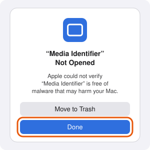
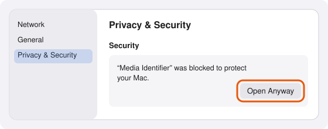
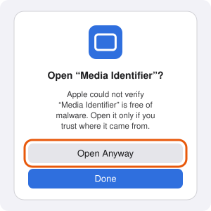
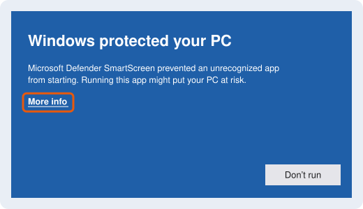
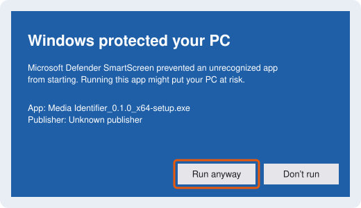

# Install

Media Identifier runs on macOS 11 or later on Apple Silicon, and on 64-bit Windows 10 or later
with a processor that supports AVX2 (Intel Core from 2013 and AMD from 2015 on; many Pentium,
Celeron and Atom processors do not, and the app says so when it starts identifying). Download it
from the [Releases page](https://github.com/thomas-lane/media-identifier/releases/latest):

| System | File |
|---|---|
| macOS (Apple Silicon) | `Media.Identifier_<version>_aarch64.dmg` |
| Windows (64-bit) | `Media.Identifier_<version>_x64-setup.exe` |

The builds are not code-signed: signing requires paid certificates from Apple and from a
Windows certificate authority, which this project does not use. Each system therefore asks you
to confirm, once, that you want to open an app from an unidentified developer.

The pictures below are simplified drawings that mark where to click; the exact wording of the
dialogs depends on the version of macOS or Windows.

## macOS

1. Open the `.dmg` and drag **Media Identifier** onto **Applications**.
2. Open Media Identifier from Applications. macOS says it was not opened because Apple could not
   verify it. Click **Done**.

   

3. Open **System Settings > Privacy & Security** and scroll down to **Security**. Next to
   "Media Identifier was blocked to protect your Mac", click **Open Anyway**, and confirm with your
   password or Touch ID.

   

4. In the dialog that follows, click **Open Anyway** again.

   

From then on Media Identifier opens like any other app.

If macOS instead says the app "is damaged and can't be opened", remove the mark macOS puts on
downloaded files by running this in Terminal, then open the app again:

```bash
xattr -dr com.apple.quarantine "/Applications/Media Identifier.app"
```

## Windows

1. Run `Media Identifier_<version>_x64-setup.exe`.
2. Microsoft Defender SmartScreen says "Windows protected your PC". Click **More info**.

   

3. Click **Run anyway**.

   

4. Follow the installer. It installs for your user account only, so it needs no administrator
   rights, and adds Media Identifier to the Start menu. If the Microsoft Edge WebView2 Runtime
   (which draws the app's window) is missing, the installer downloads it.

When **Smart App Control** is on (Windows 11: **Settings > Privacy & security > Windows Security
> App & browser control > Smart App Control**), Windows blocks unsigned programs without offering
**Run anyway**, so Media Identifier cannot be installed while it is on.

To uninstall, use **Settings > Apps > Installed apps**.

## Updates

With **Check for updates automatically** on (Settings > Updates), Media Identifier checks for a
new version when it starts and once a day while it stays open. **Check now** checks at once.

When a new version is found, a dialog shows what is new and asks before anything downloads:

- **Install update** downloads it, with progress, and verifies it against the project's update
  signing key. **Relaunch now** then installs it and restarts the app. If an identification is
  running, the update waits and the app relaunches when it finishes. **Later** keeps the current
  version; the download is discarded when the app quits, and the update is offered again a day
  later.
- **Remind me later** closes the dialog; the same version is offered again a day later.
- **Skip this version** stops offering that version. A newer one is offered as usual, and
  **Check now** still shows a skipped version.

On Windows the installer runs in a small progress window during the relaunch.

When the update service cannot be reached (for example while offline), background checks stay
silent and **Check now** shows "Couldn't check for updates".
Download new versions from the Releases page instead.
